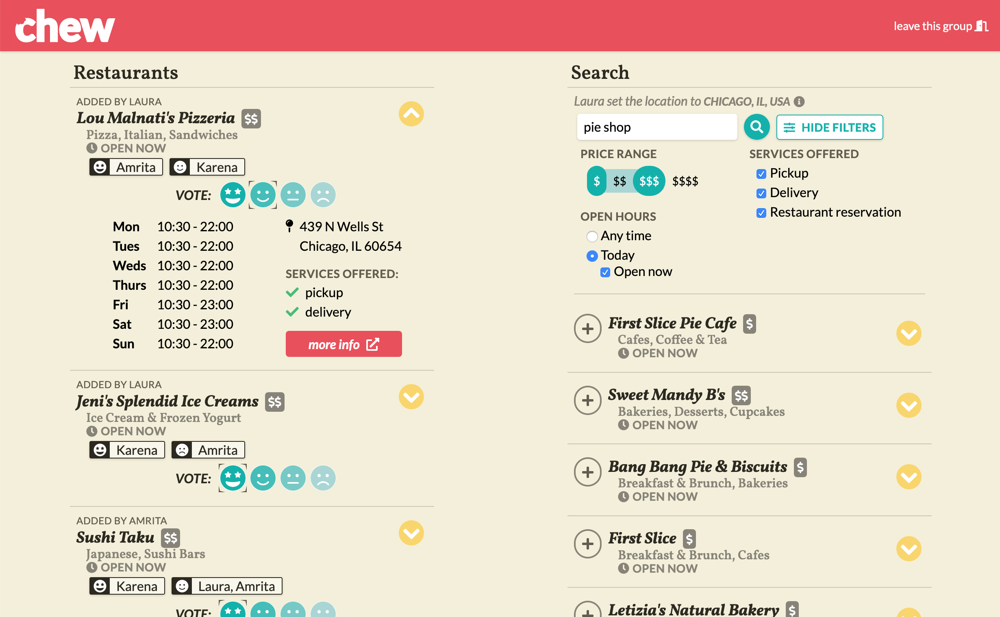

# Chew

I wanted to build an easy way for groups of people to choose a restaurant together. Other solutions I've seen require all people to use the same app or service (like Slack, Facebook Messenger, etc), while Chew is a site for desktop and mobile and also works as a progressive web app. There is no authentication required; one a user follows the link given to them by the session creator, they can join the session just by entering their name. Instead of highly contrived voting mechanisms, Chew lets users see all the options in one place, along with how their friends feel.

## Tech stack

- **Frontend**: Typescript, React, Tailwind CSS, React Router
- **Backend**: Typescript, NodeJS, Express, Socket.io, Firebase Realtime DB

## Future enhancements

My first priority is to migrate the app from using Firebase RTDB to a relational database. As the app gets more complex I need a database that can support more complex queries and joins, which Firebase cannot.

- [x] User who added a restaurant can delete it
- [x] Autocomplete for restaurant search page

---

This app was built during [helloMayuko's Code with Friends Fall 2020](https://codewithfriends.io/events/cwf-fall-2020) event ✨
